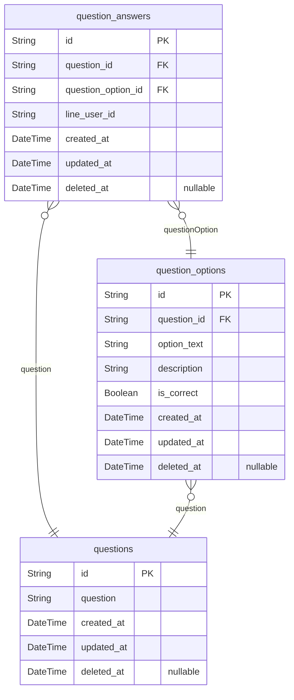
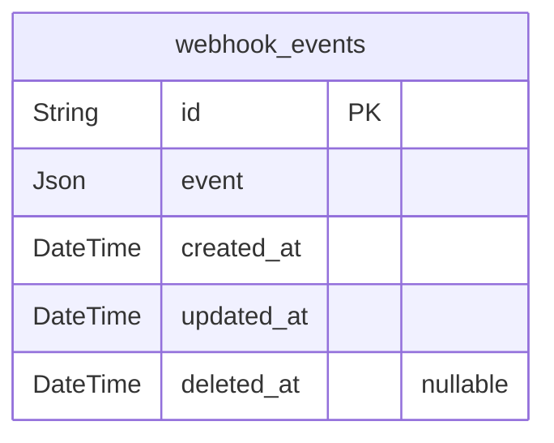

# Schema
> Generated by [`prisma-markdown`](https://github.com/samchon/prisma-markdown)

- [クイズ](#クイズ)
- [Messaging](#messaging)

## クイズ

### `question_answers`
ユーザーの回答

**Properties**
  - `id`: 
  - `question_id`: 
  - `question_option_id`: 
  - `line_user_id`: LINEユーザーID
  - `created_at`: 
  - `updated_at`: 
  - `deleted_at`: 

### `question_options`
クイズ選択肢

**Properties**
  - `id`: 
  - `question_id`: 
  - `option_text`: 選択肢テキスト
  - `description`: 選択肢解説
  - `is_correct`: 選択肢の正解フラグ
  - `created_at`: 
  - `updated_at`: 
  - `deleted_at`: 

### `questions`
クイズ

**Properties**
  - `id`: 
  - `question`: 問題文
  - `created_at`: 
  - `updated_at`: 
  - `deleted_at`: 

## Messaging

### `webhook_events`
Webhookイベント

**Properties**
  - `id`: 
  - `event`: Webhookイベント
  - `created_at`: 
  - `updated_at`: 
  - `deleted_at`: 